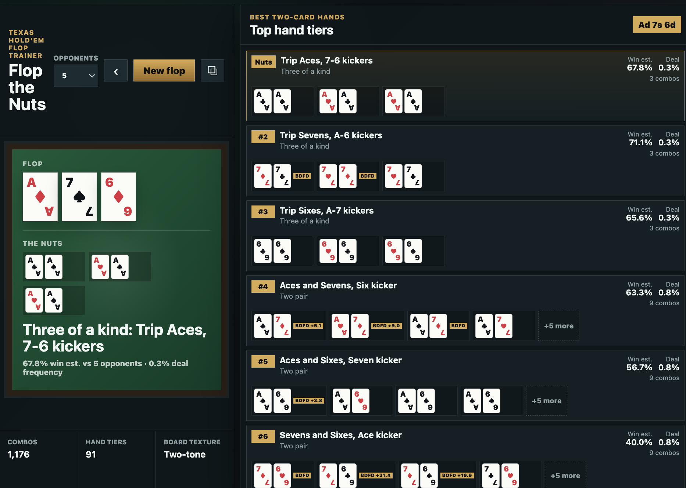

# Flop the Nuts

Interactive Texas Hold'em flop trainer.

Open `index.html` in a browser to cycle random flops and see the current nut hole cards plus the strongest ranked hand tiers. Click any board card to replace it from the deck, or click the Turn/River slots to add later streets; cards already on the board are disabled in the picker. Existing Turn/River cards can also be removed from the picker, and removing the Turn clears the River too. The evaluator ranks every legal two-card hole combo against the current board, so a flop checks 1,176 possible hands, a turn checks 1,128, and a river checks 1,081. Each visible tier shows its percentage share of those possible hole-card combos and an estimated showdown win percentage, including split-pot equity, against the selected number of random opponents.

Combos inside a tier are sorted by redraw quality, with visible tags for flush and straight potential: `FD`, `BDFD`, `SD`, and `BDSD`. Redraw tags show an estimated combo-level percentage-point lift versus matching same-rank combos without redraws when that comparison exists, such as `BDFD +1.2`; neutral redraw estimates show as `+0.0`. The row-level win estimate is averaged across the tier's combos and normalized so sampling noise does not make a lower current hand tier display above a stronger tier.

Run the evaluator smoke tests with:

```sh
npm test
```


